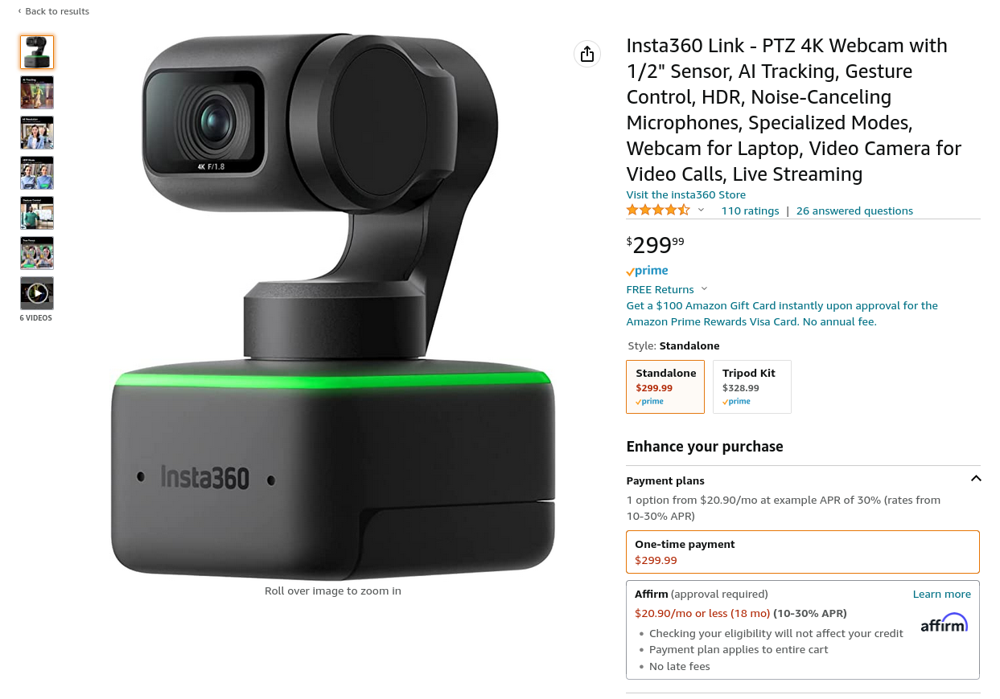
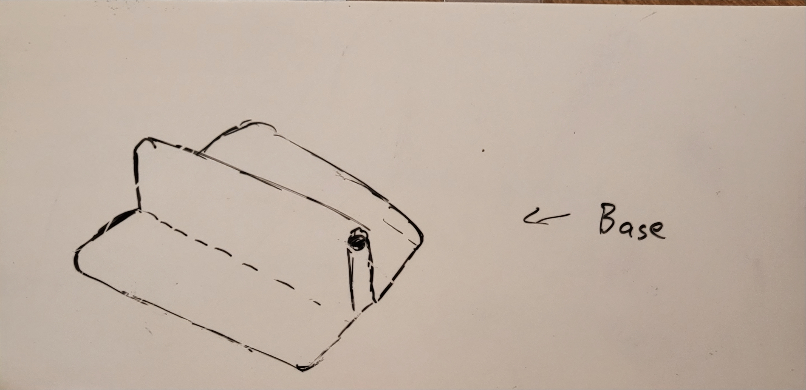
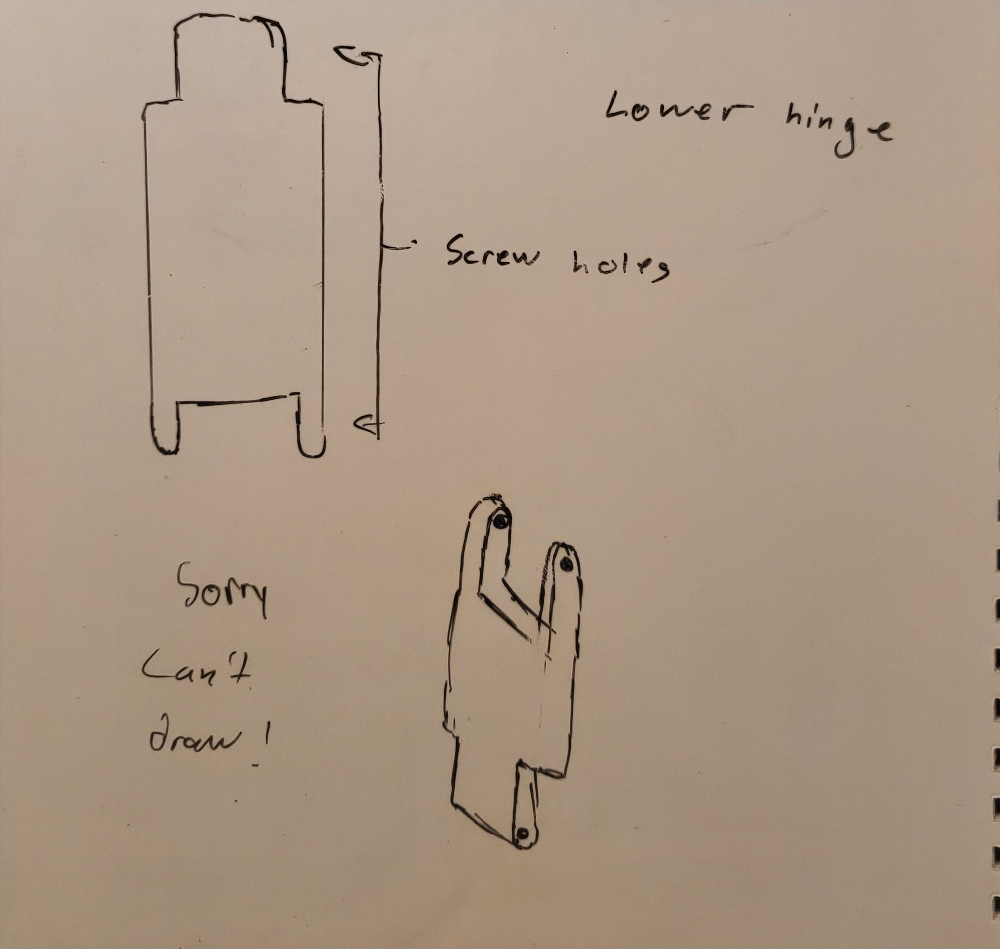
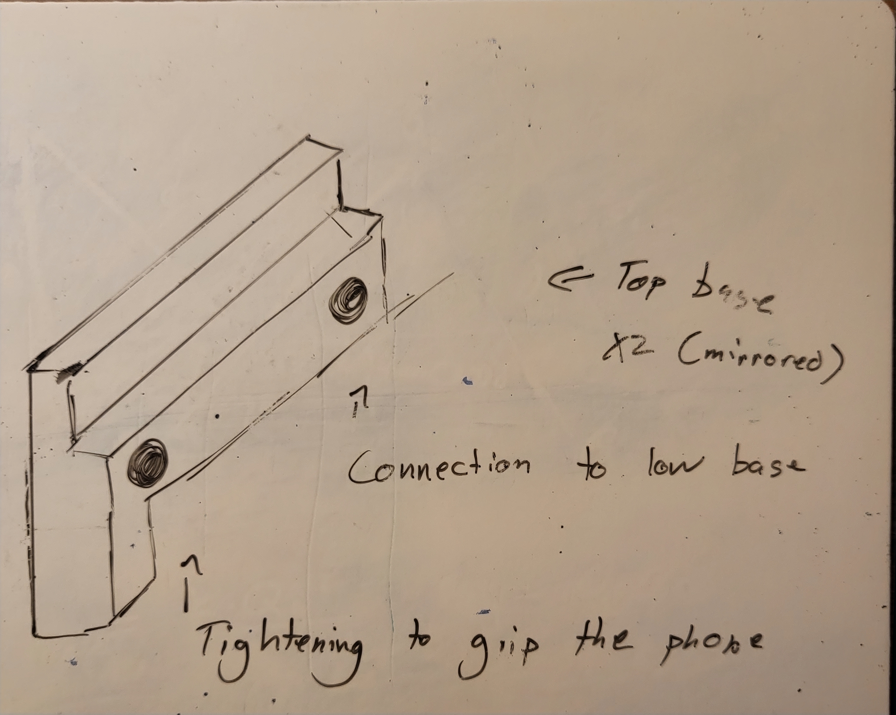
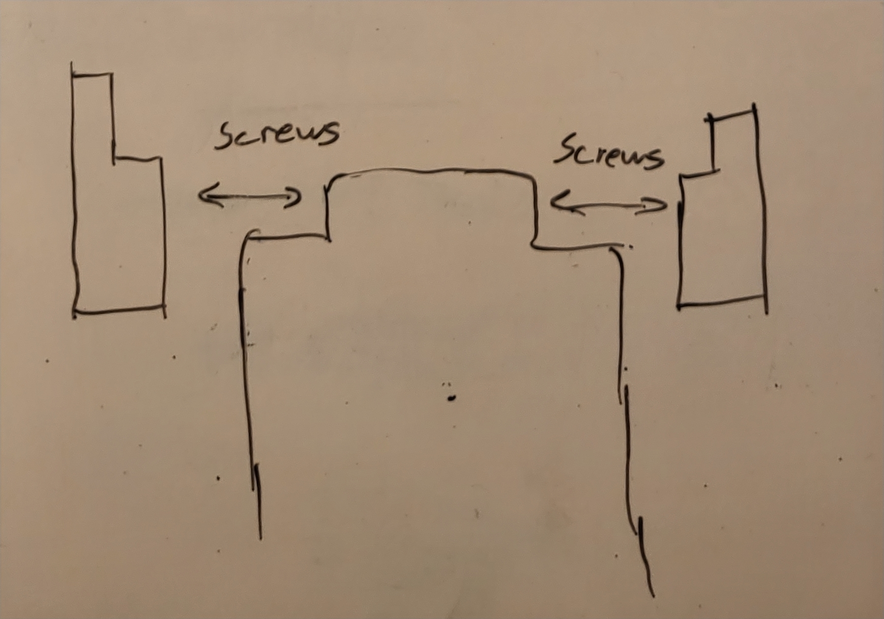
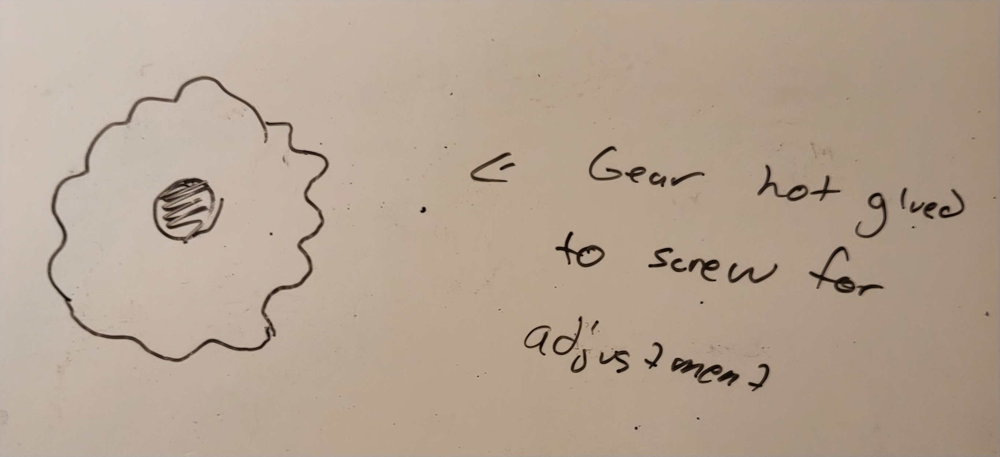

A couple of weeks ago, I saw this Short Circuit on this really cool camera: 
&nbsp;


&nbsp;

Basically, it's a camera that can shoot in 4k and can track you around the room so you never have to adjust it. It also has smart features like gesture detection and a whiteboard mode, so you don't have to fiddle around with getting the focus right or getting a whiteboard in frame. And, any settings that you change on it are saved directly on the camera, so the lack of the Insta360 software on Linux isn't as bad! Seems like an easy purchase! 
&nbsp;

&nbsp;

300 beans? I'm good. This got me thinking of how to get a webcam for [my stream](https://www.twitch.tv/imadstreaming), and so I got to thinking about how to I could use the only camera I have available to me - my phone. I did some googling and I found [DroidCam OBS](https://www.dev47apps.com/obs/), a really simple app that pipes the camera output from your phone straight to OBS. Just enable USB Debugging, plug it in, and it pops up in OBS! _It just works!_ I bought the premium version right away because paying for open-source software is something that needs to happen more often.
&nbsp;

For as good as the software is though, it can't fix the fact that my phone was always getting my bad angle since it had to be resting on my desk. So, I started to think of a mount that I could 3D print so I could look better to my 2-3 viewers.

I came up with these drafts so I could start modeling it in freecad:

 

_This is a work in progress. I'm currently modelling this on [my Twitch](https://www.twitch.tv/imadstreaming) and I'll update this post once I finish making it._
